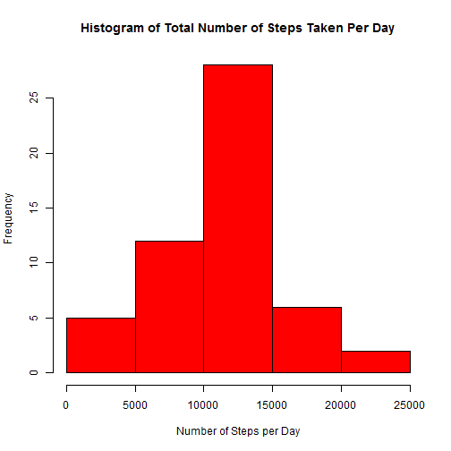
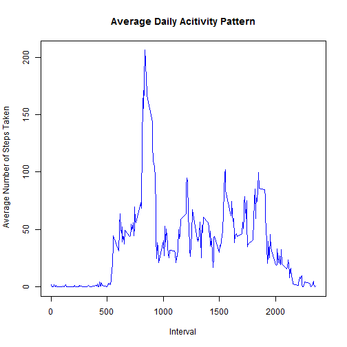
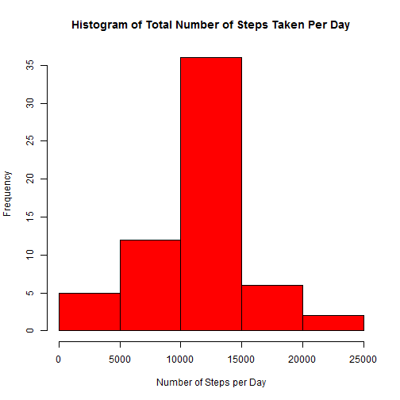
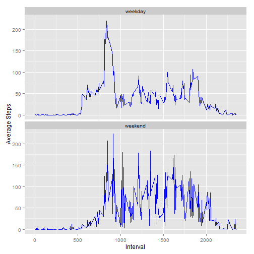

## Loading and preprocessing the data


```r
# Load required pacakages
library(downloader)
library(dplyr)
library(ggplot2)
```


```r
# checks for existence of the zip file in the working directory; if not found downloads from given URL

if(!file.exists("activity.zip")) {
  fileUrl <- "http://d396qusza40orc.cloudfront.net/repdata%2Fdata%2Factivity.zip"
  download(fileUrl, dest = "activity.zip", mode = "wb")
}

# read file & preprocess data
unzip("activity.zip")
my_activity <- read.csv("activity.csv", header = TRUE, sep = ",", stringsAsFactors = FALSE, na.strings = "NA")
my_activity$date <- as.Date(my_activity$date)
```

  
  
    
## What is mean total number of steps taken per day?
  
    
    

```r
my_q1tbl <- na.omit(my_activity)
req_q1tbl <- my_q1tbl %>% group_by(date) %>% summarise(sum(steps))
colnames(req_q1tbl) <- c("date", "TotalSteps")
hist(req_q1tbl$TotalSteps, col = "Red", main = "Histogram of Total Number of Steps Taken Per Day", 
     xlab = "Number of Steps per Day")
```

 

```r
orgstat <- summarise(req_q1tbl, mean = mean(TotalSteps), median = median(TotalSteps))
orgMean <- prettyNum(orgstat$mean)
orgMedian <- prettyNum(orgstat$median)
```
  
#### The mean number of steps taken per day is 10766.19.    
#### The median for number of steps taken per day is 10765.   
  
  
  
  
## What is the average daily activity pattern?
  
    
#### The time-series graph below shows average number of steps taken during 5-minute intervals in a day.  
  
    

```r
req_q2tbl <- my_q1tbl %>% group_by(interval) %>% summarise(mean(steps))
colnames(req_q2tbl) <- c("interval", "AvgSteps")
plot(req_q2tbl$interval, req_q2tbl$AvgSteps, type = "l", col = "Blue", 
     main = "Average Daily Acitivity Pattern", 
     xlab = "Interval", ylab = " Average Number of Steps Taken")
```

 

```r
maxinterval <- filter(req_q2tbl, AvgSteps == max(AvgSteps))
intMax <- maxinterval$interval
```
  
    
#### On average across all days, the 5-minute interval that contains the maximum number of steps is 835.   
  
  
  
        
## Imputing missing values  
  
    
    

```r
missing <- sum(is.na(my_activity))
```
  
    
    
#### The total number of rows with missing values is 2304.
  
    
    
#### The strategy adopted to fill-in the missing values: **Use the mean for the particular 5-minute interval.**  
  
    
    

```r
filldata <- cbind(req_q2tbl, my_activity)
filldata$steps <- ifelse(is.na(filldata$steps), filldata$AvgSteps, filldata$steps)
filldata <- filldata[, !duplicated(colnames(filldata))]
completedb <- select(filldata, interval, steps, date)
```
  
    
    
#### The Histogram below gives the pattern of total number of steps taken each day after filling in the missing values
  
  
   

```r
req_q3tbl <- completedb %>% group_by(date) %>% summarise(sum(steps))
colnames(req_q3tbl) <- c("date", "TotalSteps")
hist(req_q3tbl$TotalSteps, col = "Red", 
     main = "Histogram of Total Number of Steps Taken Per Day", 
     xlab = "Number of Steps per Day")
```

 

```r
newstat <- summarise(req_q3tbl, mean = mean(TotalSteps), median = median(TotalSteps))
newMean <- prettyNum(newstat$mean)
newMedian <- prettyNum(newstat$median)
```
  
    
    
#### The mean number of steps taken is now 10766.19.
#### The median of number of steps is now 10766.19.
  
    
#### As seen above, there is no change in the mean. However, median is now higher and equal to mean.
  
    
      
  
## Are there differences in activity patterns between weekdays and weekends?
  
  
#### The following time-series graphs show the activity levels for "weekdays" and "weekend".   
  
  
  

```r
completedb <- mutate(completedb, day = weekdays(date))
completedb <- mutate(completedb, daytype = ifelse(day == c("Saturday", "Sunday"), "weekend", "weekday"))
completedb$daytype = as.factor(completedb$daytype)
weekdaysum <- completedb %>% group_by_(.dots = c("daytype", "interval")) %>% summarise(mean(steps))
colnames(weekdaysum) <- c("daytype", "interval", "AvgSteps")
p <- ggplot(weekdaysum, aes(x = interval, y = AvgSteps)) + geom_line(color = "blue") 
a <- p + facet_wrap(~ daytype, nrow = 2, ncol = 1) + labs(x = "Interval", y = " Average Steps")
print(a)
```

 
  
    
#### As seen from the graph above, the activity pattern during the day remains more or less similar during weekdays & weekends. However, during the weekend the Average Steps taken are mostly higher for most of the 5-minute intervals.  

